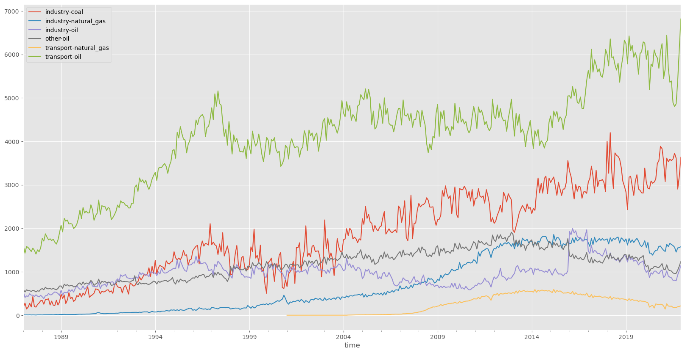

# Thailand CO2 Emission Prediction
## Background
Thailand is a developing country that is rapidly growing and industrializing, which has led to a significant increase in CO2 emissions over the years. 
As a result, the Thai government has set targets to reduce greenhouse gas emissions, including CO2, by 20% by 2030. Accurate predictions of CO2 emissions 
can aid in developing and implementing effective policies to achieve these targets.

## Problem Statement
Thailand Energy Policy and Planning Office (EPPO) publishes CO2 emission statistics by source and fuel type. CO2 emission source includes transport, 
industry, and others, while fuel type consists of oil, coal, and natural gas. Your goal is to predict the total CO2 emission by source and 
fuel type for 2022.
Train data: monthly CO2 emission from 1987 to 2021 by source and fuel type
Test data: monthly CO2 emission for 2022 by source and fuel type

Expected column headers:
- year
- month
- source
- fuel_type
- emission_tons

## Evaluation
The evaluation metric in Root Mean Squared Error (RMSE). The lower the RMSE value, the better our model's accuracy in making predictions. 
It provides a comprehensive measure of the differences between the predicted and actual values, giving us valuable insights into the performance 
of our forecasting model.

## conclusion
In conclusion, the total estimated emission in 2022 is 154,621.600. On average, transport_oil sources contribute 40.27% to the total emissions, 
industry_oil contributes 10.86%, other_oil contributes 10.86%, industry_coal contributes 23.94%, transport_natural_gas contributes 4.01%, 
and industry_natural_gas contributes 10.06%.

These findings provide an intriguing insight into the extent of each sector's contribution to emissions. With a better understanding of 
the main emission sources, steps can be taken to reduce the negative impact on the environment.

This data offers valuable insights in the efforts to combat climate change and promote sustainability. By understanding the contributions of 
these sectors, strategic measures can be implemented to improve air quality and reduce gas emissions.

With this understanding, we can work together to achieve sustainable development goals and protect the environment for future generations.

